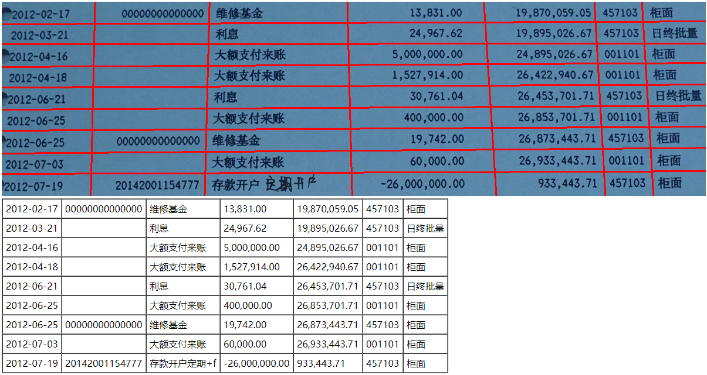

<!--自述文件-->
# 表格 OCR
识别印刷表格内容

## 编译
- 集成开发环境为 `IDEA`, 建议升级为最新版本, 低版本可能无法编译启动
- 如果 `IDEA` 没有自动设置 `jdk`, 需要自己手动设置 `File/Project Structure/Project/Project SDK` 选择 `1.8`
- 在 `IDEA` 中安装 `lombok` 插件, `File/Settings/Plugins`
- 启用 `lombok` 插件, `File/Settings/Build, Execution, Deployment/Compiler/Annotation Processors` 勾选 `Enable annotation processing`
- 设置 `gradle`, `File/Settings/Build, Execution, Deployment/Build Tools/Gradle` 选中 `Use default gradle wrapper (recommended)`

## 辅助线要求
- 颜色: `RGB(255,0,0)`(红色)
- 宽度: `[1px-3px]`
- PhotoShop: 不能开启抗锯齿(打开抗锯齿无法识别)
- 辅助线可以不横平竖直,但是必须画到边

## 代码运行
- 运行程序
- 访问 [传送门](http://localhost:8080/) 上传图片识别
- 访问 [传送门](http://localhost:8080/demo) 查看内置示例

## 前置条件
- 原图识别会出现部分列连在一起无法分割的情况
- 拍摄内容非横平竖直不易区分行列
- 字过大识别率较低,可能与阿里识别服务未使用较大字体训练有关

## 实现思路
- 调整图片大小保证字体大小适中
- 画辅助线,根据辅助线将图片分成大小不等的矩形
- 调用阿里云文本识别服务,返回文字和所在矩形(**阿里云账号信息为个人账号,请勿用于生产**)
- 将识别结果派分到划分的矩形中
- 由于英文逗号会被识别为中文逗号,分派时将中文逗号替换为英文逗号
- 为了剔除干扰识别结果,分派数据时只分派了面积最大的文本矩形,会导致一个单元格多行的只能识别最长的行

## 阿里云文本识别服务购买地址

## 示例图片识别结果

